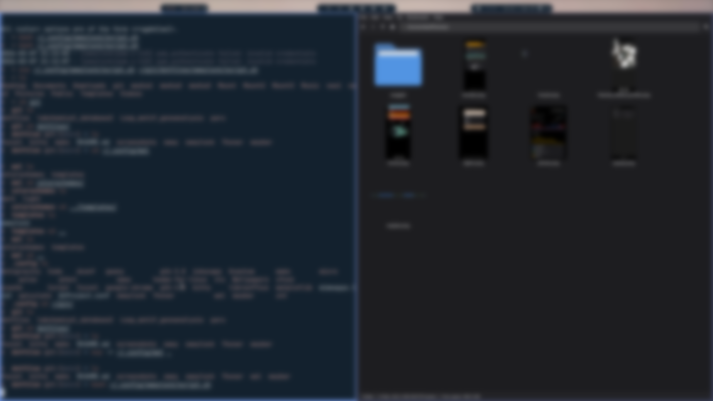
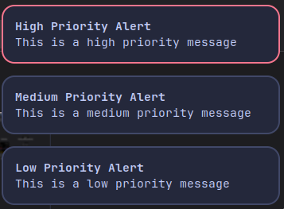

# Dotfiles

My personal dotfiles for a Linux desktop environment using Sway window manager on Arch Linux.

## Overview

This repository contains configuration files for various tools and applications I use in my daily setup. It's designed for a Wayland-based desktop with Sway as the window manager.

## Included Configurations

- **Sway**: Window manager configuration with custom scripts for screenshots, wallpaper management, and screen recording.
- **Kitty**: Terminal emulator with theme and tab configurations.
- **Waybar**: Status bar with custom styling and configurations for both Sway and Hyprland.
- **Fuzzel**: Application launcher.
- **Mako**: Notification daemon.
- **Swaylock**: Screen locker.
- **Thunar**: File manager with custom actions and accelerators.

## Installation

1. Clone this repository:
   ```bash
   git clone https://github.com/yourusername/dotfiles.git ~/.dotfiles
   ```

2. Use a dotfiles manager like [stow](https://www.gnu.org/software/stow/) to symlink the configurations:
   ```bash
   cd ~/.dotfiles
   stow */
   ```

   Or manually create symlinks for each config directory.

3. Ensure all required packages are installed. On Arch Linux:
   ```bash
   sudo pacman -S sway kitty waybar fuzzel mako swaylock thunar
   ```

## Key Features

- **Sway Scripts**: Custom scripts for common tasks like taking screenshots with `grim` and `slurp`, setting wallpapers, and recording screens.
- **Kitty Themes**: Dynamic theme switching support.
- **Waybar Styles**: Custom CSS styling with multiple themes.
- **Thunar Custom Actions**: Additional context menu actions for file management.

## Requirements

- Arch Linux (or compatible distribution)
- Wayland display server
- Sway window manager
- The listed applications and their dependencies

## Customization

Feel free to fork and modify these configurations to suit your needs. The setup is modular, so you can pick and choose which parts to use.

## Screenshots

### Waybar

*Custom status bar showing system information and modules.*

### Swaylock

*Screen locker with custom styling.*

### Mako

*Notification daemon displaying system notifications.*

### Fuzzel

*Application launcher with fuzzy search.*

## License

This project is licensed under the MIT License - see the [LICENSE](LICENSE) file for details.
